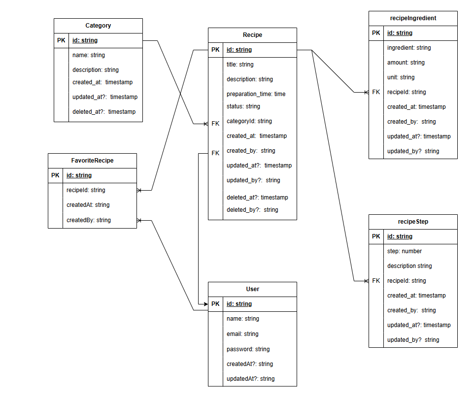

# 🧑‍🍳 Snack Jar

Aquele seu livro de receitas com papel velho e mofado agora de forma digital para você salvar a receita da vovó.

## 📌 About

**Snack Jar** é uma API backend para gerenciamento de **receitas privadas**, onde usuários podem armazenar, organizar e acessar suas receitas pessoais de forma prática e segura.  

A aplicação foi desenvolvida utilizando **Node.js** e **TypeScript**, seguindo princípios de **Clean Architecture** e conceitos de **Domain Driven Design (DDD)** para garantir escalabilidade e separação clara de responsabilidades entre as camadas da aplicação.

O sistema possui autenticação segura utilizando **JWT com cookies HTTP-only**, suporte a **login social com Google OAuth 2.0**, além de autenticação tradicional com e-mail e senha.

A API utiliza **Express** como framework, **Prisma ORM** para acesso ao banco de dados e **Zod** para validação de dados.  
O projeto também conta com **testes automatizados unitários e end-to-end utilizando Vitest**, garantindo maior confiabilidade e qualidade no desenvolvimento.

## 🚀 Features

- Cadastro e autenticação de usuários
- Login social com Google OAuth
- Cadastro e gerenciamento de receitas
- Sistema de favoritos
- Pesquisa e filtro de receitas
- Gerenciamento de ingredientes e etapas

📄 **Documentação completa de requisitos (RF / RNF):**  
[Ver documento](https://drive.google.com/file/d/1PTGbxawSF4LGZ_OWl6w4UfVvGpPE2xJk/view?usp=sharing)

## 🗄️ Diagrama Entidade Relacionamento (DER)

O diagrama abaixo representa a estrutura do banco de dados da aplicação
e os relacionamentos entre as principais entidades do sistema.

<p align="center">
  
</p>

## 🏗️ Arquitetura

### Entity (Domain)
- Representa a entidade de negócio com as propriedades dentro do domínio.

```ts
export interface RecipeProps {
  title: string
  description: string
  preparationTime: number
  status: RecipeStatus
  /*...*/
}

export class Recipe {
  constructor(
    private readonly _id: UniqueEntityID,
    private props: RecipeProps
  ) {}
}
```

### Use Case (Application Layer) 
- Contém a lógica de negócios da aplicação e administra as interações entre as entidades do domínio e os repositórios.

```ts
export class CreateRecipeUseCase {
  constructor(
    private recipeRepository: RecipeRepository,
    private categoryRepository: CategoryRepository
  ) {}

  async execute(data: CreateRecipeUseCaseRequest) {

    const recipe = Recipe.create({
      title: data.title,
      description: data.description,
      preparationTime: data.preparationTime,
      status: RecipeStatus.ACTIVE,
      /*...*/
    })

    await this.recipeRepository.create(recipe)

    return success({ recipe })
  }
}
```

### Repository Interface (Dependency Inversion)
- Define o contrato para persistência de dados permitindo que a aplicação permaneça independente das implementações de infraestrutura.

```ts
export interface RecipeRepository {
  create(recipe: Recipe): Promise<void>
  findById(id: string): Promise<Recipe | null>
  findManyByUserId(userId: string, page: number, perPage: number): Promise<{ recipes: Recipe[]; totalCount: number }>
}
```

## ▶️ Run

### 1️⃣ Clone o repositório
```
git clone https://github.com/GuilhermeOliveiraAgenor/snackjar-backend.git
cd snackjar-backend
```

### 2️⃣ Instalar dependências

```
npm install
```

### 3️⃣ Configurar variáveis de ambiente
Utilize o `.env.example` como base para configurar o arquivo `.env`.
```
cp .env.example .env
```

### 4️⃣ Subir serviços no Docker (PostgreSQL e Redis)
```
docker compose up -d
```

### 5️⃣ Executar migrations do banco de dados
```
npx prisma generate
npx prisma migrate dev
```

### 6️⃣ Executar seed
```
npm run seed
```

### 7️⃣ Iniciar o servidor
```
npm run dev
```

## 🧪 Testes

### Executar testes unitários

```
npm run test
```

### Executar testes E2E

```
npm run test:e2e
```
